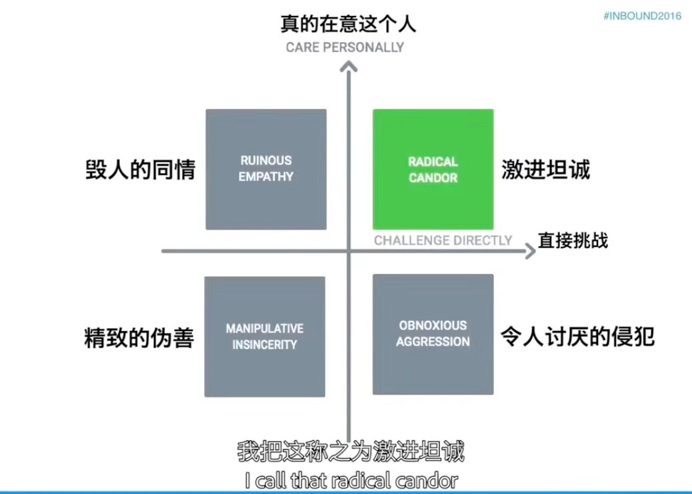

> 此文档记录即刻团队在工作中总结出来的原则，以及相应的制度，在没有制度或制度没有解释清楚的情况下，大家也能够根据**原则**作出自己的判断和决策。
> 对此文档的任何问题可以提 issues 讨论

# 🗣沟通原则

- 信息透明：在各团队之间建立良好的沟通反馈渠道，每个人有义务保证自己或团队的工作过程及决策理由能让其他同事清楚了解。
- 充分表达：在有疑惑或不同意见时，应当**激进坦诚**地提出和表达。

- 高效协作：做好时间管理，尽量避免因为自己的时间安排调整影响到其他人，会议发起人尤其应该把握会议目标和进度。

### ☕️产品 Open hour 发散讨论会
每周召集一次讨论会，在 all hands 开放区域进行，由产品部门选择针对某一功能模块进行发散讨论。其他各部门同事根据兴趣选择参加，**每季度必须参加一场**。 

### 👂Last Wednesday 周期性反馈
为想法发声。Leader 每月在团队内收集工作和研究的阶段性成果，和对包括但不限于工作流程，公司制度等各方面的反馈。在每月最后一周的Leader 会议上汇总，讨论相应措施。

### 👵☕️ CEO 咖啡时间

- 员工：可随时向 CEO 私聊发起 1on1
- CEO：HR 每月定期发起一次 1on1 征集，每个人都可回复报名

### 🚦在即刻怎么开会？

- 必须在会议室? 可以在开放区域，鼓励公开讨论
- 预约会议室, 日历上邀请。管理日程，便于召集，避免时间冲突。
- 确认会议时长, 避开饭点
- 确定明确的会议讨论内容, 决策的事项
- 不止步于充分表达
- 会后给参与者同步会议的结论及 To-Do 事项

## ⏳项目执行原则

- 乐观构想：在构想时避免陷入过多细节，高估执行难度，提前放弃。
- 悲观计划：应当提前考虑到所有可能出问题的地方并做好防范，避免侥幸心理，付出足够努力。
- 乐观执行：在具体执行时保持高热情，抱着必胜心态把事情做好。

### 💬项目各方尽早参与进来，充分讨论

- 发起：Ownership！在 sprint 周期中或是运营发起的活动项目，每个项目必须有 owner，通常是提出需求的产品或发起活动的运营，对项目的整个生命周期负责，包括资源的协调安排，牵头和发起成果的展示，结果的总结和复盘。
- 评审：在立项时需要有各方 senior 工程师参与，该工程师的职责是给产品方案在工程角度提出合理建议，拒绝不合理的需求，传达需求意图和工程设计考虑给具体实施的工程师。
- 如果是较大型的项目或活动，建议制定 code name，让整个项目执行过程有一定仪式感。

### 💿back&up! 项目复盘
有始有终。在项目上线的同时需要明确复盘的时间点，参与复盘的成员为项目参与方和 xxd，总结成功经验和失败教训，并存档到 Phabricator 上，方便以后学习回顾。**如果你觉得参与的某个项目应该复盘但没有及时安排，应该提醒督促项目 owner。**

# 🏆奖励原则

- 鼓励积极热忱地做事
- 鼓励团队共同建造

### 🎓Show Time (优秀项目表彰)
由 leader 发掘，提交对公司或团队有较大贡献的优秀项目，在每月15号，由该项目参与人介绍给全公司，包括做了什么事情，带来哪些好处，让所有同事能共享成就感和学习经验。
评判标准：
- 对公司核心业务目标有显著帮助
- 技术上有重大突破
- 能显著提升工作效率

> 什么样的项目可以入选 Show Time？

任何项目，包括日常工作中参与的项目，或是参与 Au Award 的 side project，只要满足 Show Time 的评判标准，就有可能被选中。

### 🆙半年 Performance Review 加成
即刻er 每半年的个人表现 review 中, leader 和 manager 会在打分的时候参考你的 Show Time 的参加数量（当然，还是以日常工作的产出为主）。

### ⭐Au Award
任何人都可以发起 Side project，在黄榜上公开募集队员，完成上线即可获得 Au Award。

> 什么样的项目可以参加 Au Award？

任何项目，对于因为优先级或产品排期安排不上的项目是个不错的选择，但是发起人一旦选择在黄榜上发起，就意味着这个项目完全由自己和队员自主负责，公司和各业务团队没有义务提供任何帮助，发起人需要凭借自己的个人信誉和沟通能力，自行协调和调度资源。为了项目顺利进展，建议多和利益相关方沟通。

